# 扩展Lombok
**注意：**此文是 [扩展你的lombok][1] 的更新版本。lombok更新了，有一些小变化，本文将手把手教你在lombok上扩展自己的自定义注解。

<!--more-->

# 扩展lombok
和之前一样，你需要准备好你的运行环境。jdk11、jdk8、ant和eclipse

## 准备环境
### 下载与安装jdk
考虑到oracle的jdk非得登录之后才能下载。建议使用[openjdk][2]或者[华为镜像][3]。需要注意的是，你需要在本地安装两个jdk，一个jdk8一个jdk11以上。如下图，我们本次安装jdk8和jdk17。

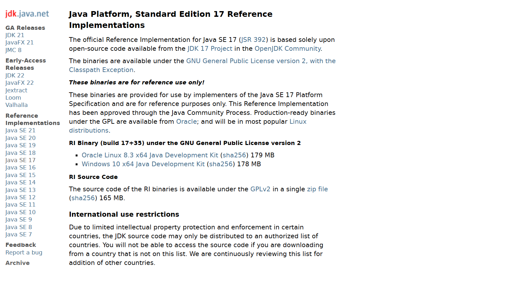

下载解压后需要将jdk17设置环境变量，ant需要使用。
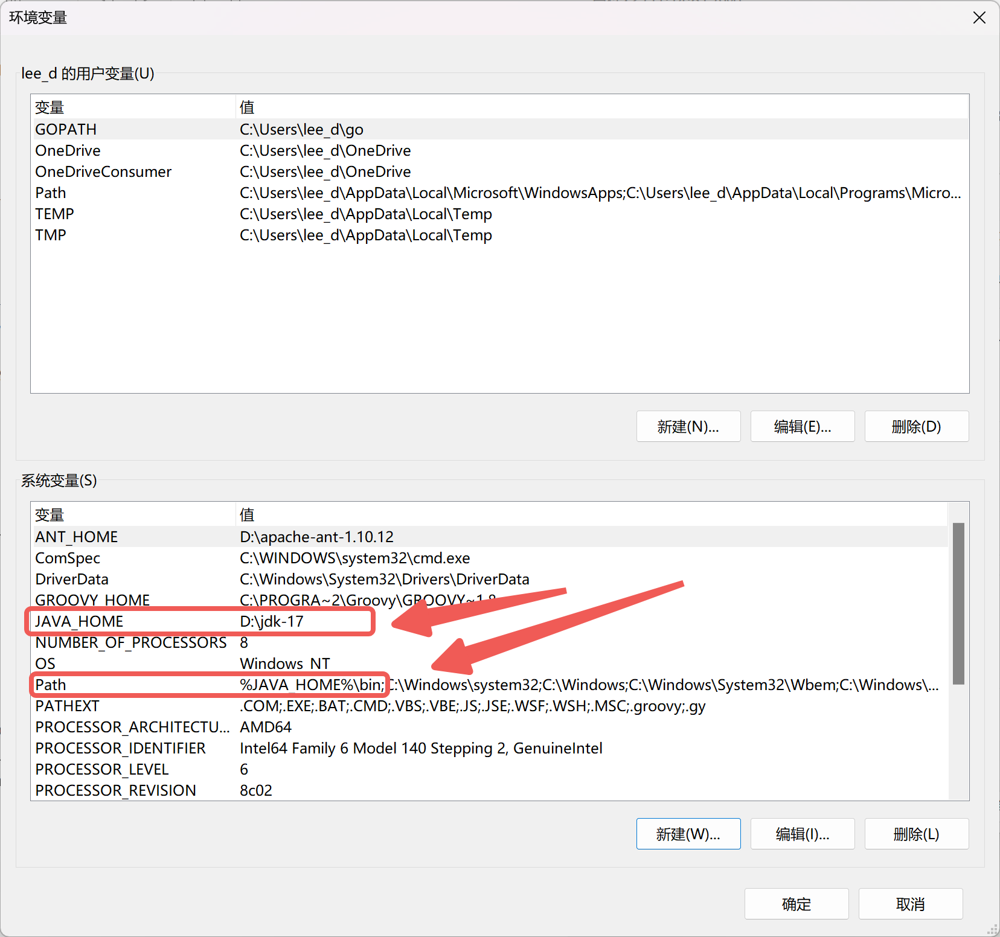

你可以使用下面命令检查是否已经安装完成。
> java -version

### 下载与安装ant
lombok是一个ant项目，需要使用[ant构建][4]、使用ivy管理依赖，不过我们不用下载ivy，lombok作者自己扩展了一个ivyplusplus在构建的时候会自行下载。
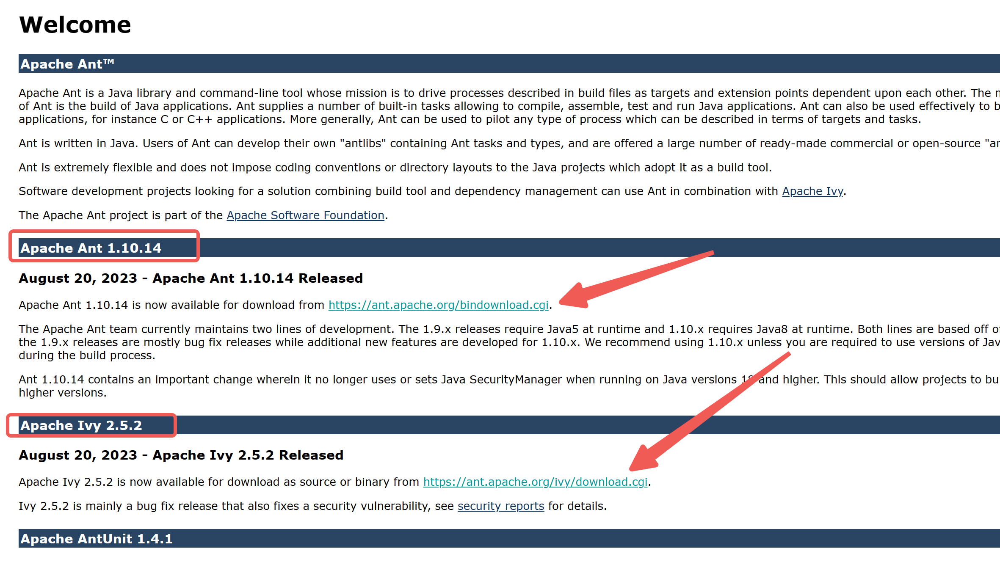

下载完成后解压，将ant设置环境变量。

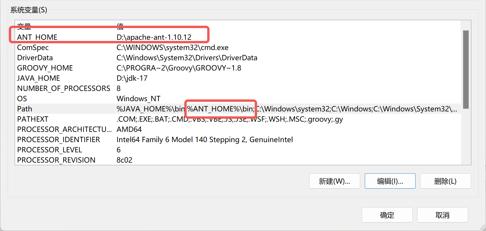

你可以通过下面的命令检查ant是否正常运行。ant是依赖java的，你需要先安装java才能使用ant。

> ant

### 下载与安装eclipse，这里使用sts
sts是[spring tools suite][5]的简写，它增强了eclipse使其更加适合开发spring应用。它其实和eclipse是一样的。

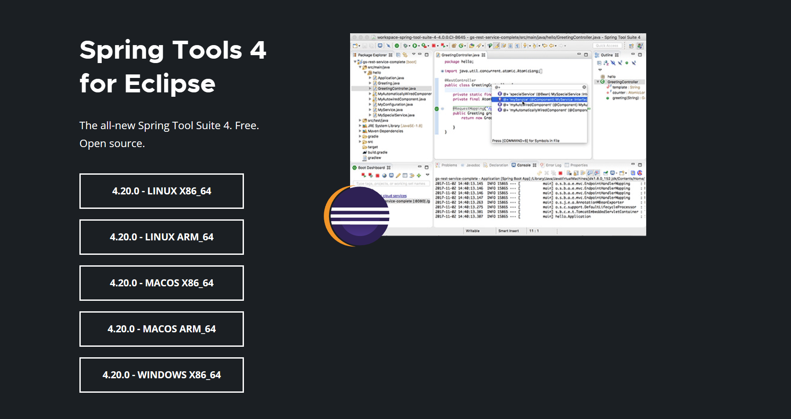

下载得到一个jar文件，你可以使用下面的命令自动解压，将jar文件当作zip打开，其内部有一个contents.zip压缩包，解压它就是我们需要的软件。

> java -jar 你下载的jar文件

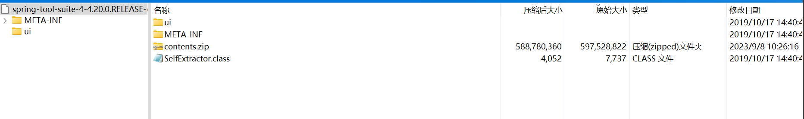

解压完成你就获取到了对于的软件，执行SpringToolSuite4.exe即可打开软件。

**现在我们的环境已经准备好了。**

## 开发

### clone项目初始化环境
考虑到国内的网络环境，我修改了一些配置，预先下载了一些包将其放到了gitee。建议你直接clone这个项目，使用这个项目开发。

> git clone https://gitee.com/lishiyuan_cn/lombok_cn.git lombok

项目一百多MB可能需要下载一段时间。下载完成后进入lombok_cn文件夹，**重命名lib-pre文件夹为lib（预先下载的库在里面）**。
使用ant或者ant quickstart命令可以查看如何开始，使用ant help可以查看帮助。具体更多构建命令需要查看本项目的xml配置（build.xml和buildScripts文件夹下面的xml配置）。这里我们需要下面命令将项目初始化为eclipse项目

> ant eclipse

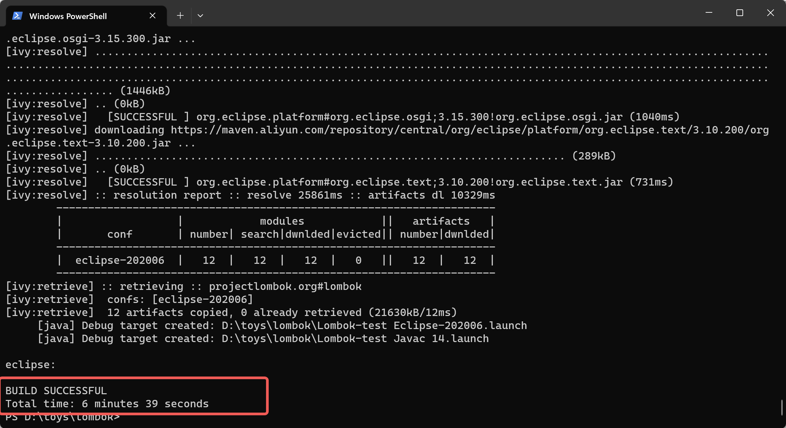

依赖的包有点多，需要下载一段时间，我已经将仓库修改成了国内的阿里的maven仓库，最起码不会超时了。构建命令完成后打开sts（eclipse）导入项目。

> File > Import... > Existing Project Into Workspace

我们扩展lombok需要关注javac与ejc的测试。后续我们执行debug也是保持一致的写法。

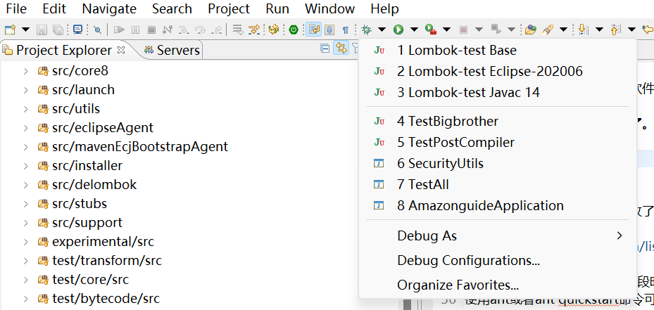

我们可以先执行javac测试导入之后能不能debug，理论上现在已经可以运行了，因为默认会使用eclipse自带的jdk执行。

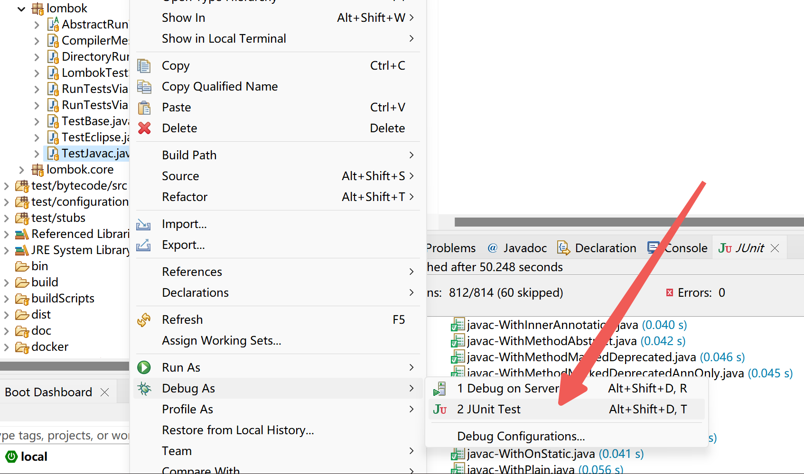

如果不能执行则需要配置Build Path，则需要使用配置前文的jdk8和jdk17，我们优先选择jdk17执行，如果不行再切到jdk8，配置到我们的运行环境。有两个地方，一是项目开发的jdk，二是单元测试的jdk。

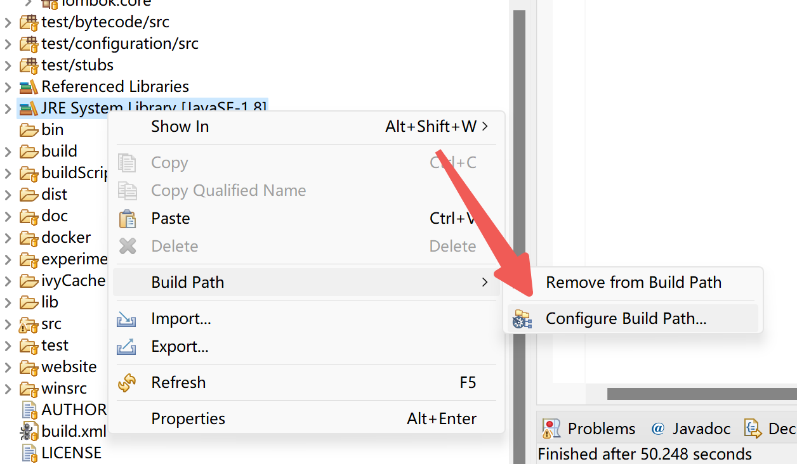

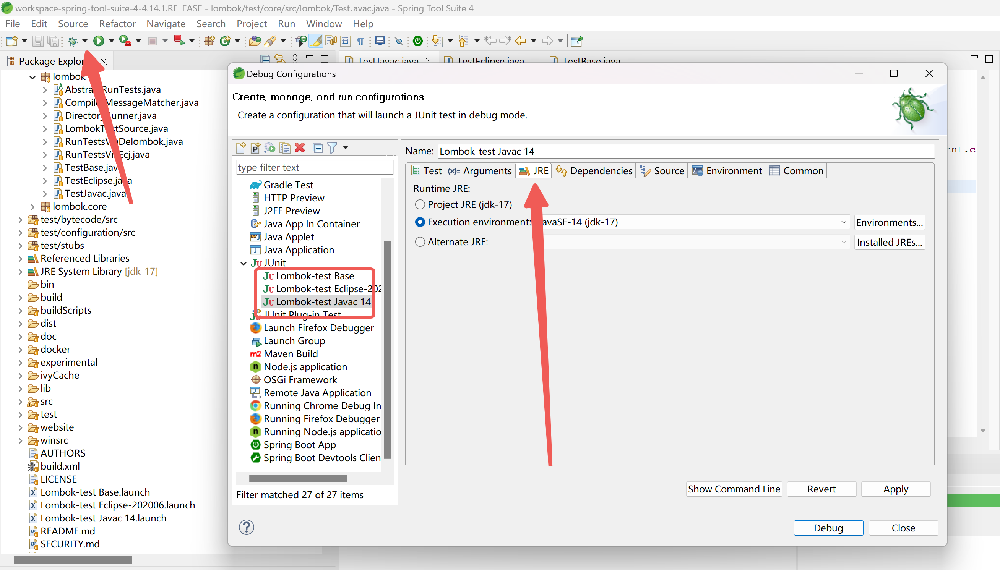

我们执行ejc的单元测试会遇到找不到dist/lombok.jar的问题

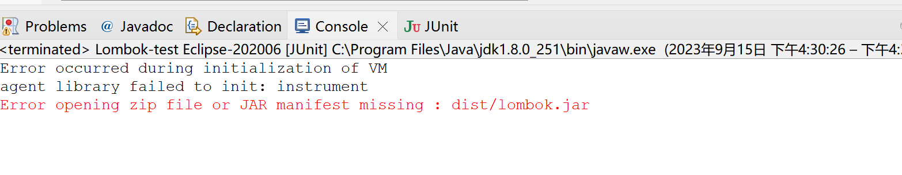

需要执行ant dist生成lombok.jar后就可以执行了。

> ant dist

### 开发功能

前文我们的环境已经完全准备好了。本次依然是开发啊一个ToJsonString的功能：给添加了@ToJsonString的类添加一个toJsonString方法，使用fastjson。

首先我们需要在ivy.xml导入fastjson的类，当然其实不导入也不会影响功能。
```
<dependency org="com.alibaba" name="fastjson" rev="2.0.4"  conf="test->master"/>
```

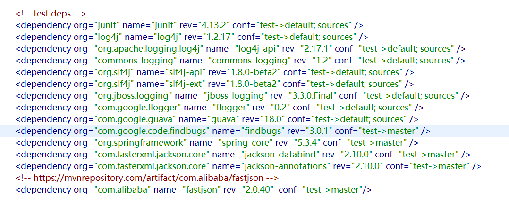

执行ant deps将fastjson依赖下载回来，后续测试的时候会用到。

> ant deps

#### 添加@ToJsonString注解类

```java
package lombok.extern.json;

import java.lang.annotation.Retention;
import java.lang.annotation.Target;

import static java.lang.annotation.ElementType.*;
import static java.lang.annotation.RetentionPolicy.SOURCE;

/**
 * Annotation for generating a JSON string from a class.
 * create a toJsonString method in the class.
 */
@Target({TYPE})
@Retention(SOURCE)
public @interface ToJsonString {
}
```

向ConfigurationKeys添加flag
```java
package lombok;

public class ConfigurationKeys {
    // 此处省略一大堆
    public static final ConfigurationKey<FlagUsageType> TO_JSON_STRING_FLAG_USAGE = new ConfigurationKey<FlagUsageType>("lombok.extern.json.toJsonString.flagUsage", "Emit a warning or error if @ToJsonString is used.") {};
}
```

#### 实现JavacAnnotationHandler

```java
package lombok.javac.handlers;

import com.sun.tools.javac.code.Flags;
import com.sun.tools.javac.tree.JCTree.*;
import com.sun.tools.javac.util.List;
import lombok.ConfigurationKeys;
import lombok.core.AnnotationValues;
import lombok.extern.json.ToJsonString;
import lombok.javac.JavacAnnotationHandler;
import lombok.javac.JavacNode;
import lombok.javac.JavacTreeMaker;
import lombok.spi.Provides;

import static lombok.core.handlers.HandlerUtil.handleFlagUsage;
import static lombok.javac.handlers.JavacHandlerUtil.*;

/**
 * Handles the {@code ToJsonString} annotation for javac. 生成一个toJsonString方法，使用Fastjson库生成json字符串
 */
@Provides
public class HandleToJsonString extends JavacAnnotationHandler<ToJsonString> {
    @Override public void handle(AnnotationValues<ToJsonString> annotation, JCAnnotation ast, JavacNode annotationNode) {
        handleFlagUsage(annotationNode, ConfigurationKeys.TO_JSON_STRING_FLAG_USAGE, "@ToJsonString");
        
        deleteAnnotationIfNeccessary(annotationNode, ToJsonString.class); 
        JavacNode javacNode = annotationNode.up();
        // 只能作用在类上面
        if (!isClassOrEnum(javacNode)) {
            annotationNode.addError("@ToJsonString is only supported on a class or enum.");
            return;
        }
        // 幂等性检查
        MemberExistsResult memberExistsResult = methodExists("toJsonString", javacNode, 0);
        if(memberExistsResult==MemberExistsResult.EXISTS_BY_USER) {
            annotationNode.addWarning("@ToJsonString is ignored because a method named toJsonString already exists.");
        }
        // 如果不存在或者存在lombok生成的方法，则生成或者覆盖

        JCMethodDecl methodDecl = createToJsonString(javacNode,annotationNode);
        injectMethod(javacNode, methodDecl);

    }

    static JCMethodDecl createToJsonString(JavacNode typeNode,JavacNode annotationNode) {

        JavacTreeMaker maker = typeNode.getTreeMaker();
        // 注解@Override
//        JCAnnotation overrideAnnotation = maker.Annotation(genJavaLangTypeRef(typeNode, "Override"), List.<JCExpression>nil());;

        // @Override public
//        JCModifiers mods = maker.Modifiers(Flags.PUBLIC, List.of(overrideAnnotation));
        JCModifiers mods = maker.Modifiers(Flags.PUBLIC);
        // String 返回值类型
        JCExpression returnType = genJavaLangTypeRef(typeNode, "String");

        // com.alibaba.fastjson.JSON#toJSONString(java.lang.Object)
        JCExpression body = chainDots(typeNode, "com", "alibaba", "fastjson", "JSON", "toJSONString");
        // this
        JCIdent aThis = maker.Ident(typeNode.toName("this"));

        // com.alibaba.fastjson.JSON#toJSONString(this)
        JCMethodInvocation jcMethodInvocation = maker.Apply(List.<JCExpression>nil(),body, List.<JCExpression>of(aThis));

        // return com.alibaba.fastjson.JSON#toJSONString(this)
        JCReturn aReturn = maker.Return(jcMethodInvocation);
        // 块
        JCBlock block = maker.Block(0, List.<JCStatement>of(aReturn));
        // toJsonString方法
        JCMethodDecl methodDef = maker.MethodDef(mods, typeNode.toName("toJsonString"), returnType,
                List.<JCTypeParameter>nil(), List.<JCVariableDecl>nil(), List.<JCExpression>nil(), block, null);

        createRelevantNonNullAnnotation(typeNode, methodDef);
        return recursiveSetGeneratedBy(methodDef, annotationNode);
    }
}
```

#### 实现EclipseAnnotationHandler

```java
package lombok.eclipse.handlers;

import lombok.AccessLevel;
import lombok.ConfigurationKeys;
import lombok.core.AnnotationValues;
import lombok.eclipse.Eclipse;
import lombok.eclipse.EclipseAnnotationHandler;
import lombok.eclipse.EclipseNode;
import lombok.extern.json.ToJsonString;
import lombok.spi.Provides;
import org.eclipse.jdt.internal.compiler.ast.*;
import org.eclipse.jdt.internal.compiler.lookup.TypeConstants;

import static lombok.core.handlers.HandlerUtil.handleFlagUsage;
import static lombok.eclipse.handlers.EclipseHandlerUtil.*;

/**
 * Handles the {@code ToJsonString} annotation for eclipse.
 */
@Provides
public class HandleToJsonString extends EclipseAnnotationHandler<ToJsonString> {
    public void handle(AnnotationValues<ToJsonString> annotation, Annotation ast, EclipseNode annotationNode) {
        handleFlagUsage(annotationNode, ConfigurationKeys.TO_JSON_STRING_FLAG_USAGE, "@ToJsonString");

        // 生成一个toJsonString方法，使用Fastjson库生成json字符串
        EclipseNode javacNode = annotationNode.up();
        // 只能作用在类上面
        if (!isClassOrEnum(javacNode)) {
            annotationNode.addError("@ToJsonString is only supported on a class or enum.");
            return;
        }
        // 幂等性检查
        EclipseHandlerUtil.MemberExistsResult memberExistsResult = methodExists("toJsonString", javacNode, 0);
        if(memberExistsResult== EclipseHandlerUtil.MemberExistsResult.EXISTS_BY_USER) {
            annotationNode.addWarning("@ToJsonString is ignored because a method named toJsonString already exists.");
        }
        // 如果不存在或者存在lombok生成的方法，则生成或者覆盖
        MethodDeclaration methodDecl = createToJsonString(javacNode,annotationNode.get());
        injectMethod(javacNode, methodDecl);
    }

    static MethodDeclaration createToJsonString(EclipseNode typeNode, ASTNode source) {
        int sourceStart = source.sourceStart;
        int    sourceEnd = source.sourceEnd;

        // 方法逻辑表达式
        MessageSend toJSONString = new MessageSend();
        toJSONString.sourceStart = sourceStart;
        toJSONString.sourceEnd = sourceEnd;
        toJSONString.receiver = generateQualifiedNameRef(source, "com".toCharArray(),"alibaba".toCharArray(),"fastjson".toCharArray(),"JSON".toCharArray());
        toJSONString.selector = "toJSONString".toCharArray();
        ThisReference thisReference = new ThisReference(sourceStart, sourceEnd);
        toJSONString.arguments = new Expression[]{thisReference};
        toJSONString.selector = "toJSONString".toCharArray();
        // 方法定义
        MethodDeclaration methodDecl = new MethodDeclaration(((CompilationUnitDeclaration) typeNode.top().get()).compilationResult);
        setGeneratedBy(methodDecl, source);
        long p = (long) sourceStart << 32 | sourceEnd;

        // public
        methodDecl.modifiers = toEclipseModifier(AccessLevel.PUBLIC);
        // String 返回类型
        methodDecl.returnType = new QualifiedTypeReference(TypeConstants.JAVA_LANG_STRING,new long[]{p,p,p});
        setGeneratedBy(methodDecl.returnType, source);
        // @Override 注解
//        Annotation overrideAnnotation = makeMarkerAnnotation(TypeConstants.JAVA_LANG_OVERRIDE, source);
//        methodDecl.annotations = new Annotation[] { overrideAnnotation };
        methodDecl.annotations = null;
        methodDecl.arguments = null;
        methodDecl.selector = "toJsonString".toCharArray();
        methodDecl.thrownExceptions = null;
        methodDecl.typeParameters = null;
        methodDecl.bits |= Eclipse.ECLIPSE_DO_NOT_TOUCH_FLAG;
        methodDecl.bodyStart = methodDecl.declarationSourceStart = methodDecl.sourceStart = source.sourceStart;
        methodDecl.bodyEnd = methodDecl.declarationSourceEnd = methodDecl.sourceEnd = source.sourceEnd;

        ReturnStatement returnStatement = new ReturnStatement(toJSONString, sourceStart, sourceEnd);
        setGeneratedBy(returnStatement, source);
        methodDecl.statements = new Statement[] { returnStatement };

        EclipseHandlerUtil.createRelevantNonNullAnnotation(typeNode, methodDecl);
        return methodDecl;
    }

}
```

#### 调试

编写测试类

```java
package lombok;

import java.io.File;
import org.junit.runner.RunWith;

@RunWith(DirectoryRunner.class)
public class TestBigbrother extends DirectoryRunner.TestParams {
    @Override
    public DirectoryRunner.Compiler getCompiler() {
// 选择编译器
        return DirectoryRunner.Compiler.DELOMBOK;
    }
    
    @Override
    public boolean printErrors() {
        return true;
    }
    
    @Override
    public File getBeforeDirectory() {
        return new File("test/transform/resource/before");
    }
    
    @Override
    public File getAfterDirectory() {
        return new File("test/transform/resource/after-delombok");
    }
    
    @Override
    public File getMessagesDirectory() {
        return new File("test/transform/resource/messages-delombok");
    }
    
    @Override
    public boolean expectChanges() {
        return true;
    }
    
    @Override public String testNamePrefix() {
        return "javac-";
    }
    @Override public boolean accept(File file) {
// 调试BigbroSimpleTest.java
        return file.getName().contains("BigbroSimpleTest.java");
    }
}
```
添加单元测试
```
/**
 * 单元测试
 */
package lombok;

import org.junit.runner.RunWith;
import org.junit.runners.Suite;
import org.junit.runners.Suite.SuiteClasses;

@RunWith(Suite.class)
@SuiteClasses({TestBigbrother.class})
public class TestJavac2 {
}
```

在test/transform/resource/before添加测试数据，在test/transform/resource/after-delombok添加期望数据
测试：
```java
import lombok.extern.json.ToJsonString;

@ToJsonString
public class ToJsonStringData {
	private final int x = 1;
	private String name;
}
```
期望：
```java
public class ToJsonStringData {
	private final int x = 1;
	private String name;

	@java.lang.SuppressWarnings("all")
	public java.lang.String toJsonString() {
		return com.alibaba.fastjson.JSON.toJSONString(this);
	}
}
```

复制一个测试并配置测试入口与引入fastjson包，之后执行测试就行了

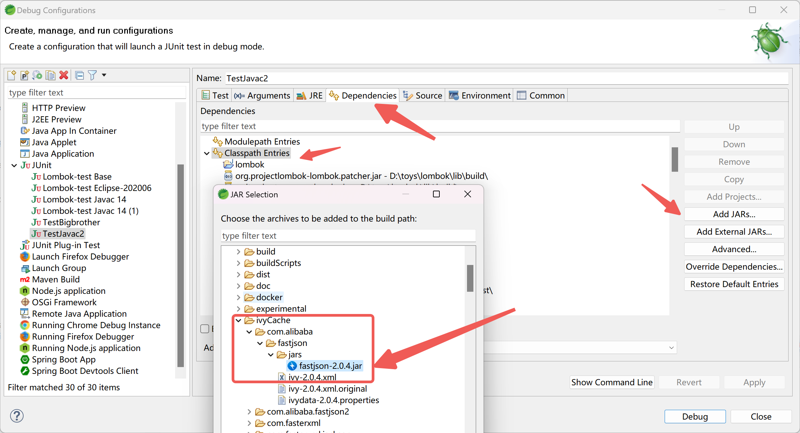

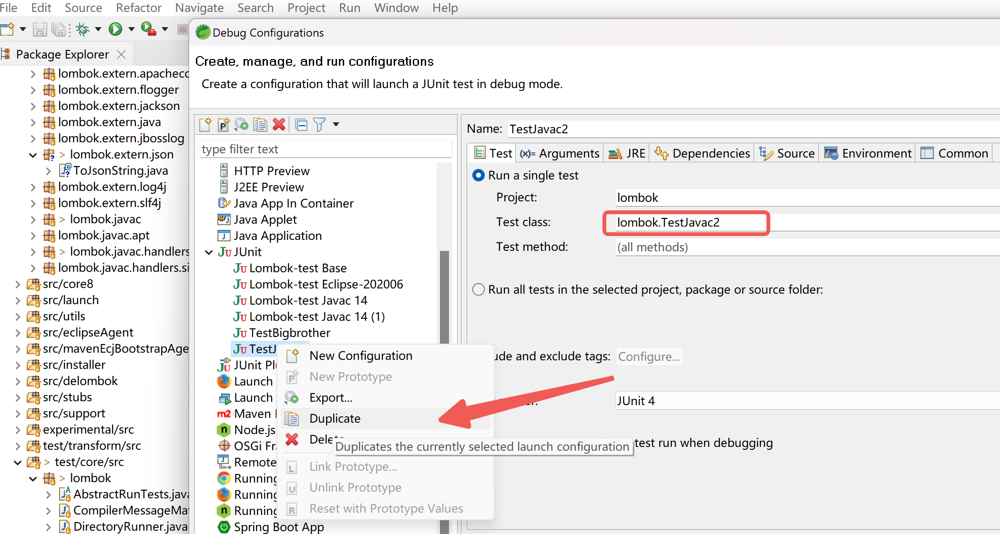


后续的ejc测试、打包发布和idea的lombok插件开发的内容和[之前的扩展你的lombok][1]一样，不再赘述。


# 以下是lombok原文readme ↓ 👇👇👇 ↓
# Project Lombok

Project Lombok is a java library that automatically plugs into your editor and build tools, spicing up your java.
Never write another getter or equals method again, with one annotation your class has a fully featured builder, automate your logging variables, and much more.

See [LICENSE] for the Project Lombok license.

Looking for professional support of Project Lombok? Lombok is now part of a [tidelift subscription]!

For a list of all authors, see the [AUTHORS] file. 

For complete project information, see [projectlombok.org]

You can review our security policy via [SECURITY.md]


 [1]: https://bigbrotherlee.com/index.php/archives/327/
 [2]: https://jdk.java.net/java-se-ri/17
 [3]: https://repo.huaweicloud.com/java/jdk/
 [4]: https://ant.apache.org/
 [5]: https://spring.io/tools
[LICENSE]: https://github.com/projectlombok/lombok/blob/master/LICENSE
[AUTHORS]: https://github.com/projectlombok/lombok/blob/master/AUTHORS
[SECURITY.md]: https://github.com/projectlombok/lombok/blob/master/SECURITY.md
[projectlombok.org]: https://projectlombok.org/
[tidelift subscription]: https://tidelift.com/subscription/pkg/maven-org-projectlombok-lombok?utm_source=maven-org-projectlombok-lombok&utm_medium=referral&campaign=website
[博客原文]: https://bigbrotherlee.com/index.php/archives/517/